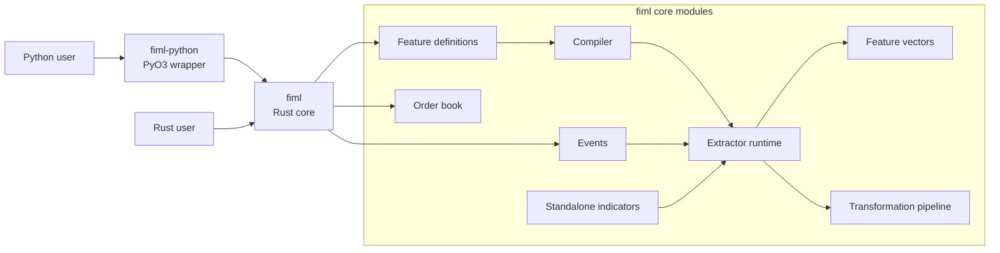
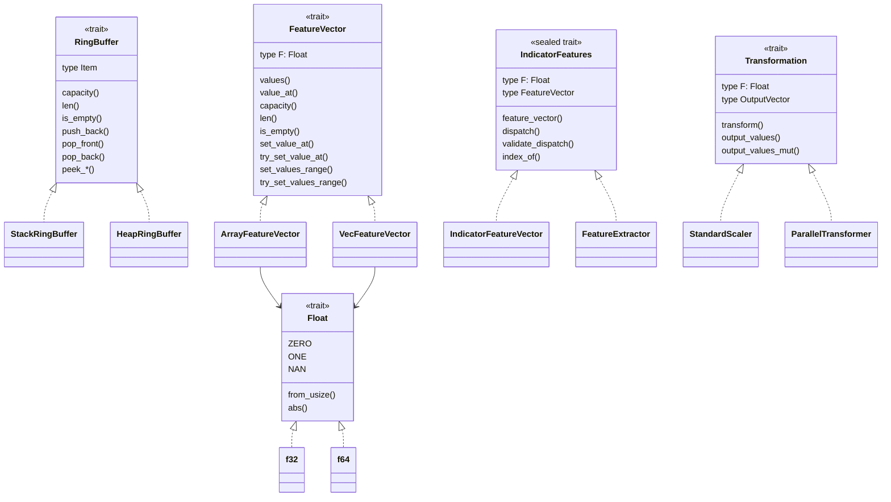
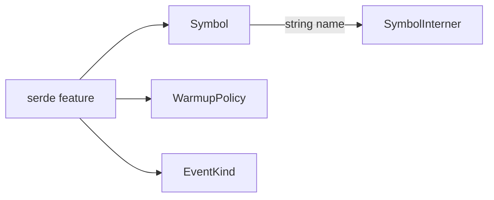

# Project type and dependency schema

This document maps the production traits, structs, and enums in the `fiml`
workspace. Test-only helper types are excluded. Serialization-only helper types
are excluded because the feature-set serialization module is currently not
compiled. The remaining `serde` feature applies only to selected scalar/public
types described below.

Dependency notation used below:

- `A --> B`: A calls, constructs, converts to, or is generically bounded by B.
- `A *-- B`: A owns B.
- `A o-- B`: A contains or borrows B through a generic/variant relationship.
- `Trait <|.. Type`: Type implements Trait.
- **Public** means reachable by a downstream Rust crate. **Internal** means
  `pub(crate)` or private.

## Workspace boundary



The feature extractor and order-book subsystems share foundational numeric and
error types, but the order book is not currently compiled into a feature
adapter.

### Active Cargo features and targets

| Item | Current state |
|---|---|
| Core default features | Empty; the normal core build enables neither `serde` nor `tracing`. |
| `serde` | Enables Serde only for `Symbol`, `WarmupPolicy`, and `EventKind`; it does not enable FeatureSet JSON. |
| `tracing` | Enables the optional tracing dependency used for pipeline diagnostics. |
| Rust examples | Automatic example discovery is disabled. `binance_trades` is the only explicitly registered example target. |
| Python core dependency | `fiml-python` depends on `fiml` without optional core features. |

## Foundational traits



| Trait | Visibility and implementations | Main dependency contract |
|---|---|---|
| `Float` | Public; implemented for `f32` and `f64` | Numeric type used by events, indicators, adapters, and feature vectors. |
| `RingBuffer` | Public; implemented by `StackRingBuffer<N, T>` and `HeapRingBuffer<T>` | Supplies bounded history to rolling indicators through its associated `Item`. |
| `FeatureVector` | Public; implemented by `ArrayFeatureVector<F, N>` and `VecFeatureVector<F>` | Stores output cells; its associated `F` must implement `Float`. Downstream implementations are allowed. |
| `IndicatorFeatures` | Public but sealed; implemented only by `IndicatorFeatureVector` and `FeatureExtractor` | Common dispatch/output interface consumed by `Pipeline` and the Python wrapper. |
| `Transformation` | Public; implemented by `StandardScaler` and `ParallelTransformer` | Consumes any `FeatureVector` with the same `F` and owns a concrete output vector. |

`WarmupPolicy` is the shared public enum used by every windowed indicator.
`FimlError` is the shared public error enum, and `Result<T>` aliases
`std::result::Result<T, FimlError>`.

## Feature definition and compilation

```mermaid
flowchart LR
    Builder["FeatureSetBuilder"] -->|build| Set["FeatureSet"]
    Set *--|ordered Vec| Scoped["ScopedIndicator"]
    Scoped o--|symbol: Option| Symbol["Symbol"]
    Symbol --> Interner["global SymbolInterner"]
    Scoped *-- Spec["IndicatorSpec"]
    Spec o-- Source["ValueSource"]
    Spec o-- Windows["TimeWindows"]
    Spec o-- Warmup["WarmupPolicy"]

    Set -->|compile| Compiler["compiler::compile"]
    Compiler --> Identity["IndicatorIdentity"]
    Compiler --> Span["OutputSpan"]
    Compiler --> Compilation["Compilation<F>"]
    Compilation *--|Vec| Entry["CompiledFeature<F>"]
    Compilation *--|Box slice| Names["canonical names"]
    Entry *-- Route["FeatureRoute"]
    Entry *-- Adapter["IndicatorFeaturesEnum<F>"]
```

The definition graph is cold-path configuration:

| Type | Visibility | Owns or depends on |
|---|---|---|
| `FeatureSetBuilder` | Public | Accumulates `Vec<ScopedIndicator>` and produces `FeatureSet`. |
| `FeatureSet` | Public | Owns the canonically ordered `Vec<ScopedIndicator>`; it does not currently implement Serde traits. |
| `ScopedIndicator` | Public | Owns an `Option<Symbol>` and one `IndicatorSpec`; global indicators use `None`. |
| `IndicatorSpec` | Public closed enum | Owns window lists, `ValueSource`, `TimeWindows`, and `WarmupPolicy` according to its variant. |
| `TimeWindows` | Public | Owns one aggregation `Duration` and ordered window `Duration` values. |
| `ValueSource` | Public | Maps a moving-average input field to `FeatureRoute` and extracts it from `Event<F>`. |
| `OutputSpan` | Internal | Start/count of adjacent output cells assigned to one compiled indicator. |
| `IndicatorIdentity` | Internal | Hash key used by the compiler to reject duplicate runtime indicators. |
| `ValidatedTimeWindows` | Internal | Compiler result containing validated aggregation/window periods. |
| `CompiledFeature<F>` | Internal | Owns one `IndicatorFeaturesEnum<F>` plus its `FeatureRoute`. |
| `Compilation<F>` | Internal | Owns compiled entries and canonical output names before fixed-capacity placement. |

### Definition-to-runtime adapter mapping

The compiler is the only construction path from `IndicatorSpec` to the closed
`IndicatorFeaturesEnum` enum.

| `IndicatorSpec` variant | `IndicatorFeaturesEnum` variant | Concrete internal adapter | Standalone calculation state | Route |
|---|---|---|---|---|
| `Sma` | `Sma` | `SmaFeature<F>` | `SimpleMovingAverage<HeapRingBuffer<F>, F, 16>` | Selected by `ValueSource` |
| `Ema` | `Ema` | `EmaFeature<F>` | `ExponentialMovingAverage<F, 16>` | Selected by `ValueSource` |
| `Cvd` | `Cvd` | `CvdFeature<F>` | `CumulativeVolumeDelta<HeapRingBuffer<F>, F, 16>` | `Trade` |
| `SmaTimed` | `SmaTimed` | `SmaTimedFeature<F>` | `SimpleMovingAverageTimed<HeapRingBuffer<(i64, F)>, F, 16>` | Selected by `ValueSource`; also observes global time |
| `ObvTimed` | `ObvTimed` | `ObvTimedFeature<F>` | `OnBalanceVolumeTimed<HeapRingBuffer<ObvBucket<F>>, F, 16>` | `Trade`; also observes global time |
| `TradeCountTimed` | `TradeCountTimed` | `TradeCountTimedFeature<F>` | `TradeCountTimed<HeapRingBuffer<CountBucket>, F>` | `Trade`; also observes global time |
| `DayOfWeek` | `DayOfWeek` | `DayOfWeek` | Adapter owns its clock state directly | Every event |
| `TimeSinceFirstEventOfDay` | `TimeSinceFirstEventOfDay` | `TimeSinceFirstEventOfDay` | Adapter owns its clock state directly | Every event |

The concrete adapter structs and `IndicatorFeaturesEnum` are internal. Downstream
customization happens at `FeatureSet` configuration, standalone indicator,
feature-vector, or transformation boundaries—not by adding extractor adapters.

## Events and routing

```mermaid
flowchart TB
    Event["Event<F>"] --> Price["PriceUpdate<F>"]
    Event --> Volume["VolumeUpdate<F>"]
    Event --> Trade["TradeUpdate<F>"]
    Event --> BookEvent["features::event::OrderBookUpdate<F>"]
    Event --> Time["TimeUpdate"]

    Price --> Symbol["Symbol"]
    Volume --> Symbol
    Trade --> Symbol
    BookEvent --> Symbol
    Trade o-- Side["TradeSide"]

    Event --> Kind["EventKind"]
    Route["FeatureRoute"] --> Kind
    Route --> Every["Every-event group"]
    Route --> Groups["IndicatorFeatureVector dispatch groups"]
```

`EventKind` discriminants index the fixed dispatch-group table. The internal
`FeatureRoute` selects one event-kind group or the every-event clock group.
`Symbol` is a compact public handle produced by the private global
`SymbolInterner`; symbol names are normalized and interned before hot-path
dispatch. ASCII identity is case-insensitive. `Symbol::GLOBAL` is the reserved
ID `0`, resolves to `"__global__"`, and is available where a concrete global
handle is useful; `ScopedIndicator` continues to represent global scope as
`None`.

The feature event named `features::event::OrderBookUpdate<F>` is only a
top-of-book `{bid, ask}` payload. It is distinct from the snapshot/delta
`order_book::OrderBookUpdate` enum described below.

## Extractor runtime and pipeline

```mermaid
flowchart LR
    Set["FeatureSet"] -->|from_feature_set| IFV["IndicatorFeatureVector<F,V,M>"]
    Compilation["Compilation<F>"] --> IFV
    IFV *--|M slots| Adapters["IndicatorFeaturesEnum<F>"]
    IFV *-- Output["V: FeatureVector<F=F>"]
    IFV *-- DispatchGroups["event-kind ranges"]
    IFV *-- Names["Box<[String]>"]

    Dynamic["FeatureExtractor"] *--|one enum variant| Boxed["Box<IndicatorFeatureVector<f64, VecFeatureVector<f64>, M>>"]
    Boxed --> IFV

    IFV -.implements.-> Shared["IndicatorFeatures"]
    Dynamic -.implements.-> Shared
    Shared --> Pipeline["Pipeline<I,T,F,V,N>"]
    Transform["T: Transformation"] --> Pipeline
    Pipeline --> Final["final feature values"]
```

| Runtime type | Visibility | Important dependencies |
|---|---|---|
| `IndicatorFeatureVector<F, V, M>` | Public | Owns fixed-capacity `IndicatorFeaturesEnum<F>` storage, caller-provided `V: FeatureVector`, route ranges, timed-adapter indexes, names, and timestamp watermark. |
| `FeatureExtractor` | Public | Macro-generated enum with capacities 16 through 128; each variant boxes an `IndicatorFeatureVector<f64, VecFeatureVector<f64>, M>`. |
| `DispatchSequenceError` | Public | Owns the failing event index and a `FimlError` for non-mutating batch validation. |
| `Pipeline<I, T, F, V, N>` | Public | Owns `I: IndicatorFeatures` and up to `N` sequential `T: Transformation<OutputVector = V>` values. |
| `StandardScaler<F, V, SIZE>` | Public | Implements `Transformation`; owns index mappings, scalar parameters, and output `V`. |
| `ParallelTransformer<F, V, T, N>` | Public | Implements `Transformation`; owns `N` child transformations and combines their outputs into `V`. |

`IndicatorFeatures` is sealed, so only the two library extractor forms can be
used as `Pipeline` inputs. `FeatureVector` and `Transformation` remain open for
downstream implementations.

## Standalone indicator state

```mermaid
flowchart TB
    Ring["R: RingBuffer"] --> SMA["SimpleMovingAverage<R,F,WINDOWS>"]
    Ring --> TimedSMA["SimpleMovingAverageTimed<R,F,WINDOWS>"]
    Ring --> CVD["CumulativeVolumeDelta<R,F,WINDOWS>"]
    Ring --> OBV["OnBalanceVolumeTimed<R,F,WINDOWS>"]
    Ring --> Count["TradeCountTimed<R,F>"]

    Float["F: Float"] --> SMA
    Float --> TimedSMA
    Float --> EMA["ExponentialMovingAverage<F,WINDOWS>"]
    Float --> CVD
    Float --> OBV
    Float --> Count

    Warmup["WarmupPolicy"] --> SMA
    Warmup --> TimedSMA
    Warmup --> EMA
    Warmup --> CVD
    Warmup --> OBV
    Warmup --> Count

    SMA *-- SmaWindow["SmaWindow<F>"]
    EMA *-- EmaWindow["EmaWindow<F>"]
    OBV *-- ObvBucket["ObvBucket<F>"]
    Count *-- CountBucket["CountBucket"]
```

| Standalone type | History item / child state | Used by extractor adapter |
|---|---|---|
| `SimpleMovingAverage<R, F, WINDOWS>` | `R::Item = F`; inline `SmaWindow<F>` array | `SmaFeature` |
| `SimpleMovingAverageTimed<R, F, WINDOWS>` | `R::Item = (i64, F)`; private timed-window state | `SmaTimedFeature` |
| `ExponentialMovingAverage<F, WINDOWS>` | Inline `EmaWindow<F>` array; no ring buffer | `EmaFeature` |
| `CumulativeVolumeDelta<R, F, WINDOWS>` | `R::Item = F`; private CVD-window state | `CvdFeature` |
| `OnBalanceVolumeTimed<R, F, WINDOWS>` | `R::Item = ObvBucket<F>`; private timed-window state | `ObvTimedFeature` |
| `TradeCountTimed<R, F>` | `R::Item = CountBucket` | `TradeCountTimedFeature` |

Each ring-buffer-based indicator can select `StackRingBuffer` for compile-time
capacity or `HeapRingBuffer` for runtime capacity. Extractor adapters currently
construct the heap-backed forms during cold-path compilation.

The window bookkeeping types `SmaWindow`, `SmaWindowTimed`, `EmaWindow`,
`CvdWindow`, and `ObvWindowTimed` are internal implementation details. The
bucket types `CountBucket` and `ObvBucket` are public because they occur in the
generic ring-buffer item constraints of their standalone indicators.

## Order-book subsystem

```mermaid
flowchart LR
    Update["order_book::OrderBookUpdate"] --> Delta["OrderBookDelta"]
    Update --> Snapshot["OrderBookSnapshot"]
    Delta *--|Vec| Change["OrderBookLevelUpdate"]
    Change --> Side["Side"]
    Snapshot *--|Vec bids/asks| Level["OrderBookLevel"]

    Book["OrderBook"] *-- Bids["BookSide (bids)"]
    Book *-- Asks["BookSide (asks)"]
    Book *--|VecDeque| Delta
    Book *-- State["SyncState"]
    Book *-- Policy["UpdatePolicy"]
    Bids *--|BTreeMap| Key["BookSideKey"]
    Asks *--|BTreeMap| Key

    Book -->|apply_update| Outcome["UpdateOutcome"]
    Book -->|failure| Error["OrderBookUpdateError"]
    Book -->|query| Depth["DepthUntilSizeResult"]
```

`OrderBookLevel`, `OrderBookLevelUpdate`, `OrderBookDelta`,
`OrderBookSnapshot`, `order_book::OrderBookUpdate`, `OrderBook`, policies,
outcomes, errors, sync state, and query results are public. `BookSide` and
`BookSideKey` are internal ordered-map details. Price and size values use
`rust_decimal::Decimal`, not the extractor's `Float` abstraction.
`OrderBookUpdateId` is the public `u64` alias shared by update, snapshot,
sequence-state, and error types.

## Serde boundary

The optional core `serde` feature currently covers only three active types:



`Symbol` serializes to its normalized string and deserializes by interning the
string. `WarmupPolicy` uses snake-case variant names, while `EventKind` uses its
derived enum representation. `FeatureSet`, `ScopedIndicator`, and
`IndicatorSpec` do not currently implement `Serialize` or `Deserialize`.

The old private implementation remains under
`crates/fiml/src/features/serialization/` as dormant source, but
`features/mod.rs` does not declare that module. Its wire types, format version,
and module tests are therefore not compiled or exposed. The JSON schema and old
JSON examples remain as repository artifacts; `autoexamples = false` and the
explicit Cargo example list keep those examples out of current build targets.

## Python binding boundary

```mermaid
flowchart LR
    PyPolicy["PyWarmupPolicy"] -->|From| Policy["core WarmupPolicy"]
    PySet["Python FeatureSet"] *-- CoreSet["core FeatureSet"]
    PySet --> Spec["IndicatorSpec"]
    PyExtractor["Python FeatureExtractor"] *-- CoreExtractor["core FeatureExtractor"]
    PyExtractor *-- Symbols["Vec<Symbol>"]
    PyExtractor *-- Dtype["OutputDtype"]
    PyExtractor --> Event["Event<f64>"]
    PyExtractor --> Buffer["OutputBuffer"]
    Buffer --> Numpy["NumPy float32/float64 array"]
```

| Binding type | Wraps or converts to | Purpose |
|---|---|---|
| `PyWarmupPolicy` (exported to Python as `WarmupPolicy`) | Core `WarmupPolicy` | Python enum conversion. |
| Python `FeatureSet` | Core `FeatureSet` | Fluent in-process configuration. |
| Python `FeatureExtractor` | Core `FeatureExtractor` | Scalar update, batch replay, symbol-handle table, and output-dtype policy. |
| `OutputDtype` | `Float32` or `Float64` | Internal output selection; calculation state remains `f64`. |
| `OutputBuffer` | `Vec<f32>` or `Vec<f64>` | Internal row-major batch buffer converted into a NumPy array. |

The binding constructs core `Event<f64>` values and calls the same sealed
`IndicatorFeatures::dispatch` implementation used by Rust callers. It depends
on the core crate without enabling `serde`; there are currently no Python
`to_json` or `from_json` entry points.

## Source map

| Area | Primary source |
|---|---|
| Numeric and warm-up types | [`crates/fiml/src/types.rs`](../crates/fiml/src/types.rs) |
| Ring buffers | [`crates/fiml/src/ring_buffer.rs`](../crates/fiml/src/ring_buffer.rs) |
| Feature vectors | [`crates/fiml/src/vectors.rs`](../crates/fiml/src/vectors.rs) |
| Symbols and interner | [`crates/fiml/src/symbols.rs`](../crates/fiml/src/symbols.rs) |
| Feature-set builder | [`crates/fiml/src/features/builder.rs`](../crates/fiml/src/features/builder.rs) |
| Feature definitions | [`crates/fiml/src/features/definition.rs`](../crates/fiml/src/features/definition.rs) |
| Events and routes | [`crates/fiml/src/features/event.rs`](../crates/fiml/src/features/event.rs) |
| Compiler | [`crates/fiml/src/features/compiler.rs`](../crates/fiml/src/features/compiler.rs) |
| Runtime storage and sealed interface | [`crates/fiml/src/features/indicator_vector.rs`](../crates/fiml/src/features/indicator_vector.rs) |
| Dynamic extractor | [`crates/fiml/src/features/extractor.rs`](../crates/fiml/src/features/extractor.rs) |
| Internal adapters | [`crates/fiml/src/features/builtin/`](../crates/fiml/src/features/builtin/) |
| Transformations and pipeline | [`crates/fiml/src/features/transformers/`](../crates/fiml/src/features/transformers/), [`crates/fiml/src/features/pipeline/mod.rs`](../crates/fiml/src/features/pipeline/mod.rs) |
| Standalone indicators | [`crates/fiml/src/indicators/`](../crates/fiml/src/indicators/) |
| Dormant feature-set serialization source | [`crates/fiml/src/features/serialization/`](../crates/fiml/src/features/serialization/) (not declared by `features/mod.rs`) |
| Order book | [`crates/fiml/src/order_book/`](../crates/fiml/src/order_book/) |
| Python bindings | [`crates/fiml-python/src/lib.rs`](../crates/fiml-python/src/lib.rs) |
| Python facade | [`crates/fiml-python/python/fiml/__init__.py`](../crates/fiml-python/python/fiml/__init__.py) |
