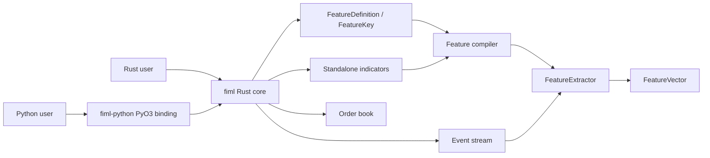
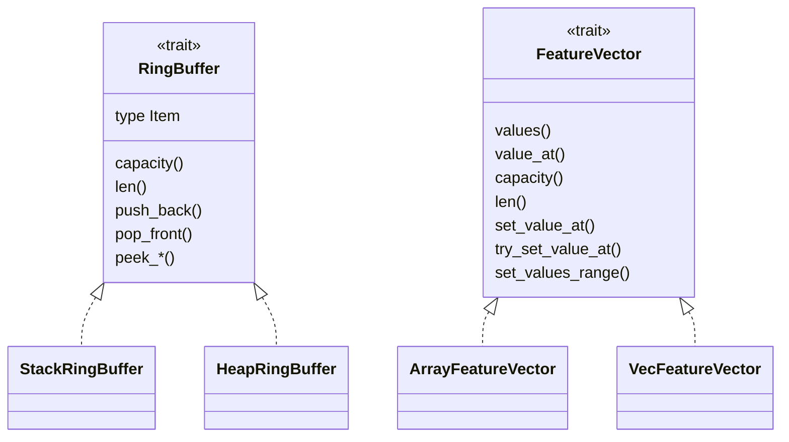

# Project type and dependency schema

This document maps the active production types in the `fiml` workspace.
Test helpers and historical designs are excluded.

Dependency notation:

- `A --> B`: `A` calls, constructs, converts to, or is bounded by `B`.
- `A *-- B`: `A` owns `B`.
- `A o-- B`: `A` contains or borrows `B` through a generic or enum variant.
- `Trait <|.. Type`: `Type` implements `Trait`.

## Workspace boundary



The extractor and order book share numeric and error types. Order-book state is
not yet exposed as a feature derivation.

### Cargo features and targets

| Item | Current state |
|---|---|
| Core default features | Empty. |
| `serde` | Enables Serde for `Symbol`, `WarmupPolicy`, and `EventKind`; feature definitions have no serialization module. |
| `tracing` | Enables optional diagnostics in selected standalone indicators. |
| Examples | Automatic discovery is disabled; `feature_extractor`, `binance_trades`, `historical_trade_replay`, and `feature_vector_spec_from_json` are explicit targets. |
| Benchmarks | Automatic discovery is disabled; `sma` and `ring_buffer` are explicit targets. |
| Python dependency | `fiml-python` uses the core without optional features. |

## Foundational abstractions



| Type | Role |
|---|---|
| `RingBuffer` | Bounded history contract implemented by stack- and heap-backed buffers. |
| `FeatureVector` | Mutable `f64` output storage. `ArrayFeatureVector<N>` avoids allocation; `VecFeatureVector` chooses size at runtime. |
| `WarmupPolicy` | Shared readiness policy for windowed calculations. |
| `FimlError` | Shared public error type; `Result<T>` aliases `Result<T, FimlError>`. |

## Feature definition and compilation

One `FeatureDefinition` describes exactly one scalar output cell. Multiple
compatible definitions can still share one runtime derivation.

```mermaid
flowchart LR
    Definition["FeatureDefinition"] *-- Key["FeatureKey"]
    Definition *-- Id["FeatureId"]
    Key o-- Symbol
    Key o-- Source["FeatureSource"]
    Key o-- WarmupPolicy
    Source --> Field["EventField"]
    Source --> Kind["EventKind"]

    Builder["FeatureExtractorBuilder"] *--|Vec| Definition
    Builder *-- Output["V: FeatureVector"]
    Builder --> Compiler["compiler::compile"]
    Compiler --> Groups["FeatureGroup"]
    Groups --> Compilation["Compilation"]
    Compilation *-- Derivations["Box<[FeatureDerivation]> "]
    Compilation *-- Spans["Box<[OutputSpan]>"]
    Compilation *-- Ids["Box<[FeatureId]>"]
    Compilation *-- Router["EventRouter"]
```

| Type | Visibility | Meaning |
|---|---|---|
| `FeatureDefinition` | Public | A structural `FeatureKey` paired with a stable user-facing `FeatureId`. |
| `FeatureKey` | Public closed enum | Complete calculation identity for one scalar output, including symbol, source, window, and warm-up policy. |
| `FeatureId` | Public | Output lookup/schema name; it may be explicit or deterministically generated from a key. |
| `FeatureSource` | Public | `Field(EventField)`, `Event(EventKind)`, or `AnyEvent`. |
| `EventField` | Public | Extractable scalar event fields: price, volume, trade price, and trade volume. |
| `FeatureExtractorBuilder<V>` | Public | Collects scalar definitions and owns the caller-selected output vector until `build`. |
| `FeatureGroup` / `GroupKey` | Internal | Cold-path grouping state for definitions that can share calculation history. |
| `OutputSpan` | Internal | Start/count of adjacent output cells written by one derivation. |
| `Compilation` | Internal | Validated derivations, spans, IDs, and routing state handed to the extractor. |

The compiler rejects duplicate keys and IDs, validates windows and sources,
groups compatible definitions, assigns contiguous output spans, and constructs
the router. Temporary maps are dropped before event processing.

### Key-to-runtime mapping

| `FeatureKey` variant | Runtime derivation | Calculation state | Route |
|---|---|---|---|
| `Sma` | `SmaFeature` | `SimpleMovingAverage<HeapRingBuffer<f64>, 16>` | Event kind selected by `EventField` and the configured symbol. |
| `Ema` | `EmaFeature` | `ExponentialMovingAverage<16>` | Event kind selected by `EventField` and the configured symbol. |
| `Cvd` | `CvdFeature` | `CumulativeVolumeDelta<HeapRingBuffer<f64>, 16>` | Trade events for the configured symbol. |
| `SmaTimed` | `SmaTimedFeature` | `SimpleMovingAverageTimed<HeapRingBuffer<(i64, f64)>, 16>` | Any event, so time advances even without a matching scalar sample. |
| `ObvTimed` | `ObvTimedFeature` | `OnBalanceVolumeTimed<HeapRingBuffer<ObvBucket>, 16>` | Any event. |
| `TradeCountTimed` | `TradeCountTimedFeature` | `TradeCountTimed<HeapRingBuffer<CountBucket>>` | Any event. |
| `DayOfWeek` | `DayOfWeek` | Clock state in the derivation. | Any event. |
| `TimeSinceFirstEventOfDay` | `TimeSinceFirstEventOfDay` | Clock state in the derivation. | Any event. |

`MAX_OUTPUTS_PER_INDICATOR` is currently 16. It bounds the adjacent scalar
outputs that can share one runtime derivation.

## Events and routing

```mermaid
flowchart LR
    Event["Event"] --> Kind["EventKind"]
    Event --> Symbol
    Event --> Timestamp

    Router["EventRouter"] *-- SymbolMap["symbol_to_index"]
    Router *-- SymbolRouters["symbol_routers"]
    Router *-- Subscribers["subscribers"]
    Router *-- Any["any_subscribers"]
    SymbolMap --> SymbolRouters
    SymbolRouters --> Subscribers
    Kind --> SymbolRouters
    Any --> Subscribers
    Subscribers --> RuntimeIndex["FeatureDerivation index"]
```

`EventKind` has six variants: price, volume, trade, order-book delta,
order-book snapshot, and time. Its discriminants index fixed routing arrays.
Each symbol/kind route is a contiguous range into the flattened subscriber
array; each stored subscriber value is a runtime derivation index. The separate
always-subscriber range contains timed and clock derivations.

`Symbol` is a compact interned handle. ASCII identity is case-insensitive.
`Symbol::GLOBAL` is reserved index `0`, resolves as `"__global__"`, and is used
by time events and global feature keys.

## Extractor runtime

```mermaid
flowchart LR
    Builder["FeatureExtractor::builder(output)"] --> Compile["build / compile"]
    Compile --> Extractor["FeatureExtractor<V>"]
    Extractor *-- Vector["V: FeatureVector"]
    Extractor *-- Features["Box<[FeatureDerivation]> "]
    Extractor *-- Spans["Box<[OutputSpan]>"]
    Extractor *-- Ids["Box<[FeatureId]>"]
    Extractor *-- Router["EventRouter"]
    Incoming["Event"] -->|handle_event| Extractor
    Router --> Features
    Features -->|write assigned span| Vector
```

`FeatureExtractor<V>` is the single runtime owner. It uses static dispatch
through the closed `FeatureDerivation` enum; there are no boxed feature
trait objects. `handle_event` performs no allocation: it validates the global
timestamp watermark, runs symbol/kind subscribers, runs always-subscribers,
and writes directly into `V`.

Public lookup/read methods are `last_timestamp`, `feature_vector`,
`feature_ids`, and `feature_index`.

## Standalone indicators

| Standalone type | History/state | Extractor derivation |
|---|---|---|
| `SimpleMovingAverage<R, WINDOWS>` | `R::Item = f64`; inline window array | `SmaFeature` |
| `SimpleMovingAverageTimed<R, WINDOWS>` | `R::Item = (i64, f64)` | `SmaTimedFeature` |
| `ExponentialMovingAverage<WINDOWS>` | Inline EMA window array | `EmaFeature` |
| `CumulativeVolumeDelta<R, WINDOWS>` | `R::Item = f64` | `CvdFeature` |
| `OnBalanceVolumeTimed<R, WINDOWS>` | `R::Item = ObvBucket` | `ObvTimedFeature` |
| `TradeCountTimed<R>` | `R::Item = CountBucket` | `TradeCountTimedFeature` |

Standalone indicators can use stack-backed history when capacity is known at
compile time. Compiled feature derivations use heap-backed history because
configuration is a cold-path runtime input.

## Order-book subsystem

```mermaid
flowchart LR
    Update["order_book::OrderBookUpdate"] --> Delta["OrderBookDelta"]
    Update --> Snapshot["OrderBookSnapshot"]
    Delta *-- Changes["Vec<OrderBookLevelUpdate>"]
    Snapshot *-- Levels["bid/ask Vec<OrderBookLevel>"]
    Book["OrderBook"] *-- Sides["bid/ask BookSide"]
    Book *-- History["VecDeque<OrderBookDelta>"]
    Book --> Outcome["UpdateOutcome"]
```

Order-book prices and sizes use `rust_decimal::Decimal`, independently of the
extractor's `f64` feature calculations. `BookSide` and its ordered-map key are internal;
updates, snapshots, policies, outcomes, errors, and query results are public.

## Serialization boundary

Under the optional `serde` feature, public `FeatureVectorSpec` is the serialization
boundary. A private adapter converts its flat, canonically ordered scalar
definitions to and from the strict grouped JSON contract. Wire-only structs
remain private, and core does not depend on `serde_json` at runtime.

## Python binding boundary

```mermaid
flowchart LR
    PySpec["Python FeatureVectorSpec"] *-- RustSpec["Rust FeatureVectorSpec"]
    RustSpec *-- Definitions["Vec<FeatureDefinition>"]
    PyExtractor["Python FeatureExtractor"] *-- Core["FeatureExtractor<VecFeatureVector>"]
    PyExtractor *-- Handles["Vec<Symbol>"]
    PyExtractor --> Events["Event"]
    Core --> Numpy["NumPy float32/float64 snapshots"]
```

The Python `FeatureVectorSpec` is a fluent convenience wrapper around the Rust spec.
Rust owns canonical ordering, deterministic default IDs, JSON conversion, and
capacity validation. Reserved trailing model cells receive deterministic
`__reserved_<index>` Python column names and remain `NaN`.

## Source map

| Area | Primary source |
|---|---|
| Numeric and warm-up types | [`crates/fiml/src/types.rs`](../crates/fiml/src/types.rs) |
| Ring buffers | [`crates/fiml/src/ring_buffer.rs`](../crates/fiml/src/ring_buffer.rs) |
| Feature vectors | [`crates/fiml/src/vectors.rs`](../crates/fiml/src/vectors.rs) |
| Symbols | [`crates/fiml/src/symbols.rs`](../crates/fiml/src/symbols.rs) |
| Events | [`crates/fiml/src/event.rs`](../crates/fiml/src/event.rs) |
| Feature definitions | [`crates/fiml/src/features/mod.rs`](../crates/fiml/src/features/mod.rs), [`feature_key.rs`](../crates/fiml/src/features/feature_key.rs), [`feature_source.rs`](../crates/fiml/src/features/feature_source.rs), [`feature_id.rs`](../crates/fiml/src/features/feature_id.rs) |
| Builder/compiler | [`feature_extractor_builder.rs`](../crates/fiml/src/features/feature_extractor_builder.rs), [`compiler.rs`](../crates/fiml/src/features/compiler.rs) |
| Extractor and router | [`feature_extractor.rs`](../crates/fiml/src/features/feature_extractor.rs) |
| Runtime derivations | [`crates/fiml/src/features/derivation/`](../crates/fiml/src/features/derivation/) |
| Transformations | [`crates/fiml/src/features/transformers/`](../crates/fiml/src/features/transformers/) |
| Standalone indicators | [`crates/fiml/src/indicators/`](../crates/fiml/src/indicators/) |
| Order book | [`crates/fiml/src/order_book/`](../crates/fiml/src/order_book/) |
| Python bindings | [`crates/fiml-python/src/lib.rs`](../crates/fiml-python/src/lib.rs) |
| Python facade | [`crates/fiml-python/python/fiml/__init__.py`](../crates/fiml-python/python/fiml/__init__.py) |
