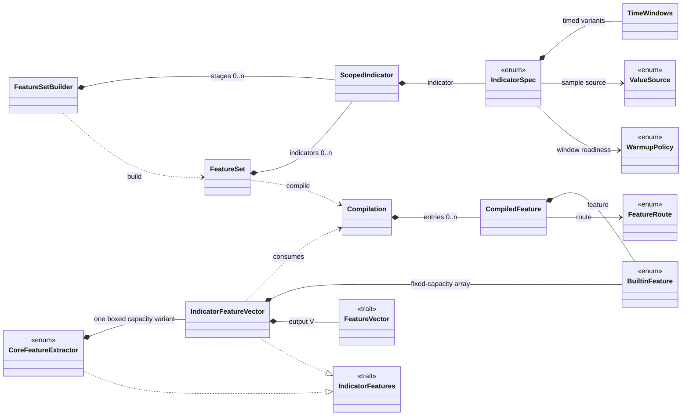
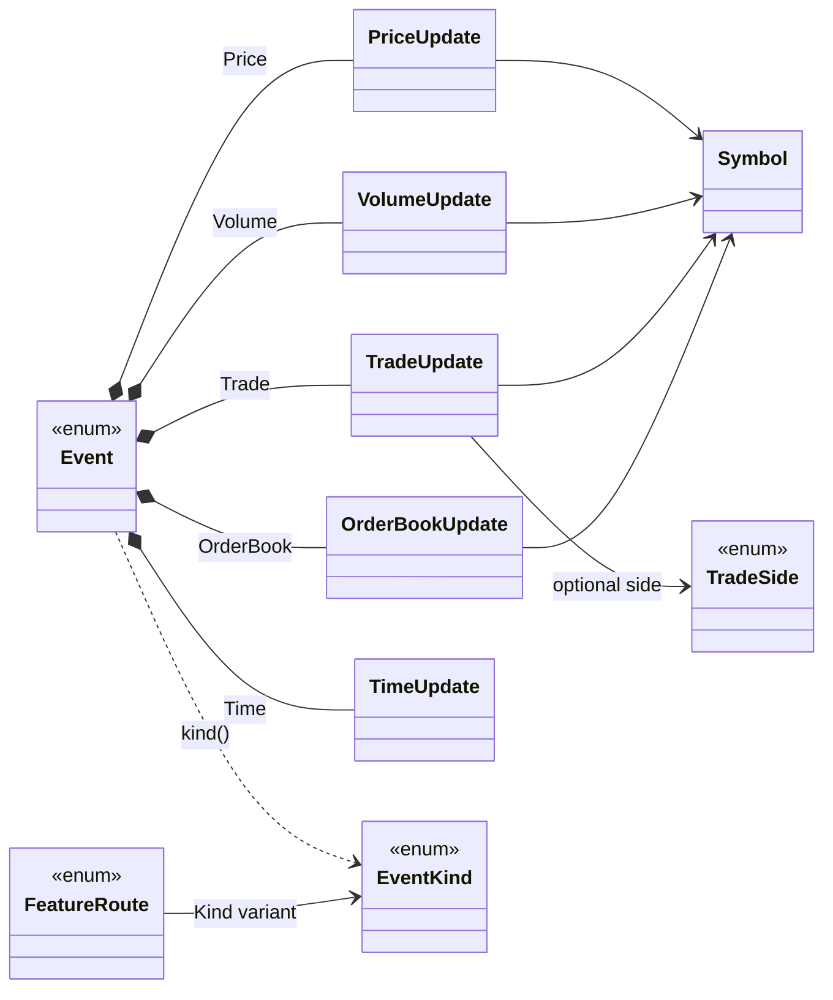
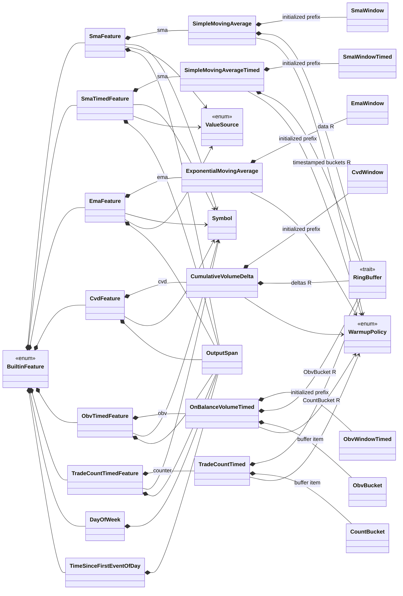
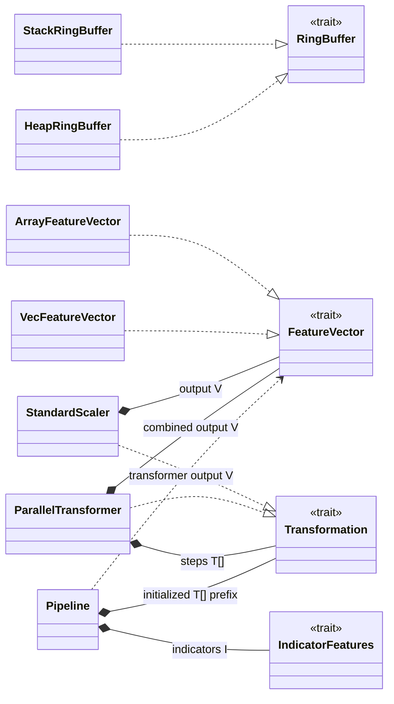
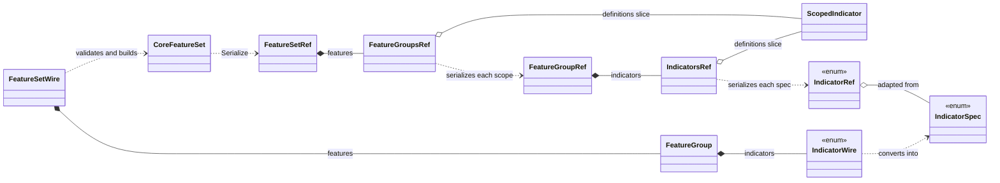
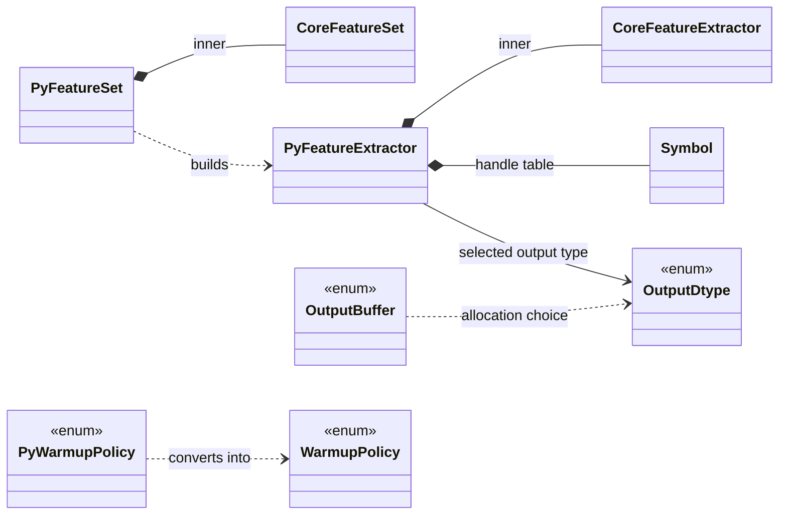

# Struct dependency schema

This document maps the production data types in the `fiml` workspace at commit
`5186748`. It covers `crates/fiml/src` and `crates/fiml-python/src`; examples,
benchmarks, tests, and test-only helper structs are excluded.

The diagrams emphasize dependencies between project types. Standard-library
containers and scalar fields are shown only when they explain ownership,
capacity, or allocation behavior.

## Relationship legend

- `A *-- B`: `A` owns `B`, usually directly, in a collection, or as an enum
  variant payload.
- `A o-- B`: `A` borrows `B`.
- `A --> B`: `A` stores a lightweight value of type `B` or has a direct
  association with it.
- `A ..> B`: `A` constructs, consumes, converts to, or is constrained by `B`,
  but does not store a concrete `B` field.
- A relation to a trait means the field is a generic type constrained by that
  trait.

Enums are included where they are the link between structs. Names prefixed with
`Py` denote types in the Python binding and avoid collisions with core names.

## Configuration to runtime

The cold path is `FeatureSetBuilder -> FeatureSet -> Compilation`. Compilation
validates definitions, assigns every indicator a contiguous output span,
generates canonical output names, and produces a `FeatureRoute` for each
`BuiltinFeature`.

`IndicatorFeatureVector<F, V, M>` consumes the temporary `Compilation`. It owns:

- caller-selected output storage `V: FeatureVector`;
- an inline `[MaybeUninit<BuiltinFeature<F>>; M]`;
- event-kind group ranges and a separate index list for timed features;
- boxed canonical names and a global last-timestamp watermark.

The runtime-sized core `FeatureExtractor` is an enum of boxed
`IndicatorFeatureVector<f64, VecFeatureVector<f64>, M>` variants, where `M` is
16, 32, ..., 128. Thus it uses dynamic output length while preserving static
dispatch and fixed indicator capacity inside the selected variant.

## Events and routing

Each market payload owns only the fields required by its event kind. `TimeUpdate`
is global and therefore has no `Symbol`. `FeatureRoute::Kind` selects one of the
five event-kind groups; `FeatureRoute::Every` selects the sixth group used by
clock features.

## Builtin features and indicator state

All feature adapters also own an `OutputSpan`; it identifies the adjacent cells
they may write. Market adapters own a `Symbol`, and moving-average adapters also
own a `ValueSource`. The diagram shows these shared dependencies explicitly.

The runtime compiler currently instantiates heap-backed ring buffers for SMA,
timed SMA, CVD, timed OBV, and timed trade count. The underlying public
indicator types are generic over `R: RingBuffer`, so direct users can instead
select `StackRingBuffer` where a capacity is known at compile time. EMA stores
its windows inline and needs no ring buffer.

Timed SMA, OBV, and trade count participate in two paths per dispatched event:
their routed market update records matching data, while the timed-feature index
list lets every event advance expiry and full-window readiness through
`observe(timestamp)`.

## Storage, transformation, and pipelines

`StackRingBuffer` stores `[MaybeUninit<T>; N]`; `HeapRingBuffer` stores a bounded
`VecDeque<T>`. Similarly, `ArrayFeatureVector` is fixed-size and stack-friendly,
while `VecFeatureVector` chooses its cell count at runtime. `Pipeline` chains
transformers serially, whereas `ParallelTransformer` runs all of its steps
against the same input and copies their results into disjoint output ranges.

## Serialization graph (`serde` feature)

Serialization deliberately uses different graphs for writing and reading:
borrowed `*Ref` adapters serialize without cloning the `FeatureSet`, while
owned `*Wire`/option values deserialize before conversion into the core graph.

The option and scalar adapter dependencies are:

| Write-side type | Direct dependencies | Read-side type | Direct dependencies |
| --- | --- | --- | --- |
| `SampleOptionsRef` | `ValueSourceValue`, borrowed windows, `WarmupPolicyValue` | `SampleOptions` | `ValueSourceValue`, owned windows, `WarmupPolicyValue` |
| `CvdOptionsRef` | borrowed windows, `WarmupPolicyValue` | `CvdOptions` | owned windows, `WarmupPolicyValue` |
| `SmaTimedOptionsRef` | `ValueSourceValue`, `DurationRef`, `DurationsRef`, `WarmupPolicyValue` | `SmaTimedOptions` | `ValueSourceValue`, `DurationValue`, owned `DurationValue` windows, `WarmupPolicyValue` |
| `ObvTimedOptionsRef` | `DurationRef`, `DurationsRef`, `WarmupPolicyValue` | `ObvTimedOptions` | `DurationValue`, owned `DurationValue` windows, `WarmupPolicyValue` |
| `TradeCountTimedOptionsRef` | two `DurationRef` values, `WarmupPolicyValue` | `TradeCountTimedOptions` | two `DurationValue` values, `WarmupPolicyValue` |
| `TimeSinceFirstEventOfDayOptionsRef` | `UtcOffsetRef` | `TimeSinceFirstEventOfDayOptions` | `UtcOffsetValue` |
| `EmptyOptions` | none | `EmptyOptions` | none |

`DurationRef` and `DurationsRef` borrow `std::time::Duration` values;
`DurationValue` owns one. `DurationDisplay` is a primitive display projection.
The UTC-offset wrappers follow the same pattern, with `UtcOffsetDisplay` as the
primitive display projection. `IndicatorRef` and `IndicatorWire` own the
corresponding option type as their variant payload. `FeatureSetRef` and
`FeatureSetWire` also own `EmptyOptions` for the top-level format options.

## Python binding

The Python layer does not reimplement indicators. Its `FeatureSet` wraps the
core `FeatureSet`, and its `FeatureExtractor` wraps the core extractor. It adds
a `Vec<Symbol>` handle table, cached feature count, and output dtype selection.
`OutputBuffer` is a temporary batch result (`Vec<f32>` or `Vec<f64>`) converted
to a NumPy array after replaying events through the core dispatcher.

## Direct dependency inventory

This table covers production structs not already completely described by the
serialization table. “None” means the struct contains only primitives or
standard-library types after generic scalar parameters are ignored.

| Module | Struct | Direct project-type dependency |
| --- | --- | --- |
| `symbols` | `Symbol` | None; compact interned `u64` id |
| `symbols` | `SymbolInterner` | `Symbol` values in both maps; globally wrapped by `LazyLock<Mutex<_>>` |
| `ring_buffer` | `StackRingBuffer<N, T>` | Generic item `T`; implements `RingBuffer` |
| `ring_buffer` | `HeapRingBuffer<T>` | Generic item `T`; implements `RingBuffer` |
| `vectors` | `ArrayFeatureVector<F, N>` | `F: Float`; implements `FeatureVector` |
| `vectors` | `VecFeatureVector<F>` | `F: Float`; implements `FeatureVector` |
| `features::definition` | `TimeWindows` | None (`Duration` values only) |
| `features::definition` | `ScopedIndicator` | `IndicatorSpec` |
| `features::definition` | `FeatureSet` | `ScopedIndicator` |
| `features::builder` | `FeatureSetBuilder` | `ScopedIndicator`; builds `FeatureSet` |
| `features::compiler` | `OutputSpan` | None |
| `features::compiler` | `CompiledFeature<F>` | `BuiltinFeature<F>`, `FeatureRoute` |
| `features::compiler` | `Compilation<F>` | `CompiledFeature<F>` |
| `features::compiler` | `ValidatedTimeWindows` | None (validated primitive vectors) |
| `features::indicator_vector` | `IndicatorFeatureVector<F, V, M>` | `V: FeatureVector`, `BuiltinFeature<F>`; consumes `Compilation<F>` |
| `features::extractor` | `DispatchSequenceError` | `FimlError` |
| `features::event` | `PriceUpdate<F>` | `Symbol` |
| `features::event` | `VolumeUpdate<F>` | `Symbol` |
| `features::event` | `TradeUpdate<F>` | `Symbol`, optional `TradeSide` |
| `features::event` | `OrderBookUpdate<F>` | `Symbol` |
| `features::event` | `TimeUpdate` | None |
| `features::builtin` | `SmaFeature<F>` | `Symbol`, `ValueSource`, heap-backed `SimpleMovingAverage`, `OutputSpan` |
| `features::builtin` | `SmaTimedFeature<F>` | `Symbol`, `ValueSource`, heap-backed `SimpleMovingAverageTimed`, `OutputSpan` |
| `features::builtin` | `EmaFeature<F>` | `Symbol`, `ValueSource`, `ExponentialMovingAverage`, `OutputSpan` |
| `features::builtin` | `CvdFeature<F>` | `Symbol`, heap-backed `CumulativeVolumeDelta`, `OutputSpan` |
| `features::builtin` | `ObvTimedFeature<F>` | `Symbol`, heap-backed `OnBalanceVolumeTimed<ObvBucket<_>>`, `OutputSpan` |
| `features::builtin` | `TradeCountTimedFeature<F>` | `Symbol`, heap-backed `TradeCountTimed<CountBucket, _>`, `OutputSpan` |
| `features::builtin` | `DayOfWeek` | `OutputSpan` |
| `features::builtin` | `TimeSinceFirstEventOfDay` | `OutputSpan` |
| `indicators::averages` | `SmaWindow<F>` | None beyond `F: Float` |
| `indicators::averages` | `SimpleMovingAverage<R, F, WINDOWS>` | `R: RingBuffer<Item=F>`, inline `SmaWindow<F>` values, `WarmupPolicy` |
| `indicators::averages` | `SmaWindowTimed<F>` | None beyond `F: Float` |
| `indicators::averages` | `SimpleMovingAverageTimed<R, F, WINDOWS>` | `R: RingBuffer<Item=(i64, F)>`, inline `SmaWindowTimed<F>` values, `WarmupPolicy` |
| `indicators::averages` | `EmaWindow<F>` | None beyond `F: Float` |
| `indicators::averages` | `ExponentialMovingAverage<F, WINDOWS>` | inline `EmaWindow<F>` values, `WarmupPolicy` |
| `indicators::volume` | `CvdWindow<F>` | None beyond `F: Float` |
| `indicators::volume` | `CumulativeVolumeDelta<R, F, WINDOWS>` | `R: RingBuffer<Item=F>`, inline `CvdWindow<F>` values, `WarmupPolicy` |
| `indicators::volume` | `ObvWindowTimed<F>` | None beyond `F: Float` |
| `indicators::volume` | `ObvBucket<F>` | None beyond `F: Float` |
| `indicators::volume` | `OnBalanceVolumeTimed<R, F, WINDOWS>` | `R: RingBuffer<Item=ObvBucket<F>>`, inline `ObvWindowTimed<F>` values, `WarmupPolicy` |
| `indicators::counts` | `CountBucket` | None |
| `indicators::counts` | `TradeCountTimed<R, F>` | `R: RingBuffer<Item=CountBucket>`, `WarmupPolicy`, `F: Float` marker |
| `features::transformers` | `StandardScaler<F, V, SIZE>` | `V: FeatureVector`, `F: Float`; implements `Transformation` |
| `features::transformers` | `ParallelTransformer<F, V, T, N>` | `T: Transformation`, output `V: FeatureVector` |
| `features::pipeline` | `Pipeline<I, T, F, V, N>` | `I: IndicatorFeatures`, initialized `T: Transformation` prefix, `V: FeatureVector` marker |
| `fiml-python` | `FeatureSet` (`PyFeatureSet` above) | core `FeatureSet` |
| `fiml-python` | `FeatureExtractor` (`PyFeatureExtractor` above) | core `FeatureExtractor`, `Symbol`, `OutputDtype` |

## Architectural observations

- The ownership graph is acyclic: configuration owns definitions, compilation
  owns transient runtime entries, and the dispatcher owns the final feature
  states and output storage.
- Hot-path polymorphism is static. `BuiltinFeature` is a closed enum and storage
  traits are generic bounds; no indicator update uses a trait object or vtable.
- Allocation is concentrated on cold paths and runtime-sized storage: definition
  vectors, compiler vectors/sets, generated names, the dynamic extractor box,
  heap ring buffers, and `VecFeatureVector`. Updates reuse this state.
- `OutputSpan` separates indicator state from output layout. One indicator can
  own multiple adjacent output cells without allocating a per-update vector.
- `Symbol` is a small copyable id. The global `SymbolInterner` owns the strings;
  event and feature structs own only the id, not an `Arc<str>`.
- The optional serialization layer and Python binding terminate at the same core
  `FeatureSet`/`FeatureExtractor` types, preserving parity between serialized,
  Python batch, and Rust live execution.
